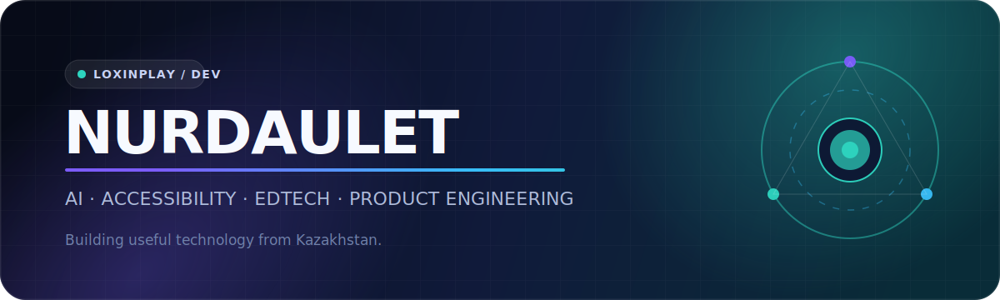

  

  
  
  

  I build practical products where <b>artificial intelligence</b>, <b>accessibility</b>, and <b>education</b> meet.
   
  My focus is turning technically ambitious ideas into clear, usable prototypes.

 

## Selected work

<table>
  <tr>
    <td width="50%" valign="top">
      <h3><a href="https://github.com/loxinplay/aimaq">Aimaq</a></h3>
      

        AI-powered location intelligence for commercial real estate in Almaty.
        It ranks listings using transport, competition, district context, and business requirements.
      

      

        <code>Next.js</code> <code>FastAPI</code> <code>LangGraph</code>
        <code>Supabase</code> <code>Redis</code>
      

    </td>
    <td width="50%" valign="top">
      <h3><a href="https://github.com/loxinplay/QazSign-2026">QazSign</a></h3>
      

        Real-time Kazakh Sign Language recognition using computer vision and deep learning,
        designed to reduce communication barriers.
      

      

        <code>Python</code> <code>MediaPipe</code> <code>TensorFlow</code>
        <code>LSTM</code> <code>FastAPI</code>
      

    </td>
  </tr>
  <tr>
    <td width="50%" valign="top">
      <h3><a href="https://github.com/loxinplay/InclusiTech">InclusiTech</a></h3>
      

        An AI-powered self-study platform that generates accessible video courses
        for learners with needs such as ADHD or dyslexia.
      

      

        <code>AI</code> <code>EdTech</code> <code>Accessibility</code>
        <code>Product Design</code>
      

    </td>
    <td width="50%" valign="top">
      <h3><a href="https://github.com/loxinplay/Mentis">Mentis</a></h3>
      

        A product centered on self-awareness, personal growth, and structured productivity,
        built as a polished web experience.
      

      

        <code>Next.js</code> <code>TypeScript</code> <code>React</code>
        <code>Vercel</code>
      

    </td>
  </tr>
</table>

## Toolkit

  

## Current direction

- Building AI systems that solve concrete, local problems.
- Designing more accessible learning and communication tools.
- Combining applied machine learning with strong product interfaces.
- Shipping complete MVPs instead of isolated technical demos.

## GitHub snapshot

  

  

## More projects

  <a href="https://github.com/loxinplay/UniZhol"><b>UniZhol</b></a>
  — a platform helping students navigate university admissions in Kazakhstan.
   
  <a href="https://github.com/loxinplay/news-digest-nfactorial"><b>News Digest</b></a>
  — an AI-oriented news aggregation and summarization project.

 

  <b>Building technology that is useful before it is impressive.</b>
    
  

